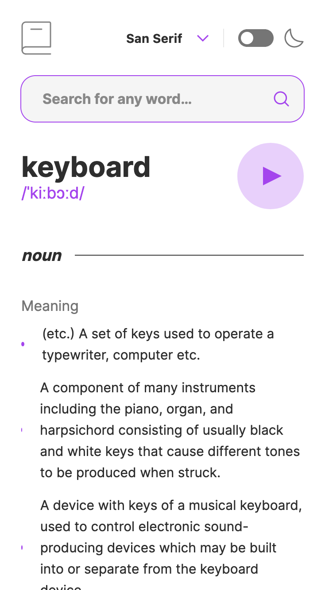

# Dictionary web app solution

## Table of contents

- [Overview](#overview)
  - [The challenge](#the-challenge)
  - [Links](#links)
  - [Screenshot](#screenshot)
- [My process](#my-process)
  - [Built with](#built-with)
  - [What I learned](#what-i-learned)
  - [Continued development](#continued-development)
  - [Useful resources](#useful-resources)
- [Author](#author)
- [Acknowledgments](#acknowledgments)

## Overview

### The challenge

Users should be able to:

- Search for words using the input field
- See the Free Dictionary API's response for the searched word
- See a form validation message when trying to submit a blank form
- Play the audio file for a word when it's available
- Switch between serif, sans serif, and monospace fonts
- Switch between light and dark themes
- View the optimal layout for the interface depending on their device's screen size
- See hover and focus states for all interactive elements on the page
- **Bonus**: Have the correct color scheme chosen for them based on their computer preferences.

### Links

- Solution URL: [Click here](https://github.com/jeancarlosruiz/dictionary-web-app-react)
- Live Site URL: [Click here](https://dictionary-web-app-reactjs.netlify.app/)

### Screenshot

#### Mobile

#### Desktop

#### Loading

#### Error

#### Error

## My process

### Built with

- Semantic HTML5 markup
- CSS custom properties
- Flexbox
- CSS Grid
- Mobile-first workflow
- [React](https://reactjs.org/) - JS library
- CSS Modules - For styles
- [Styled Components](https://styled-components.com/) - For styles

## Author

- Frontend Mentor - [@jeancarlosruiz](https://www.frontendmentor.io/profile/jeancarlosruiz)
- GitHub - [jeancarlosruiz](https://github.com/jeancarlosruiz)
